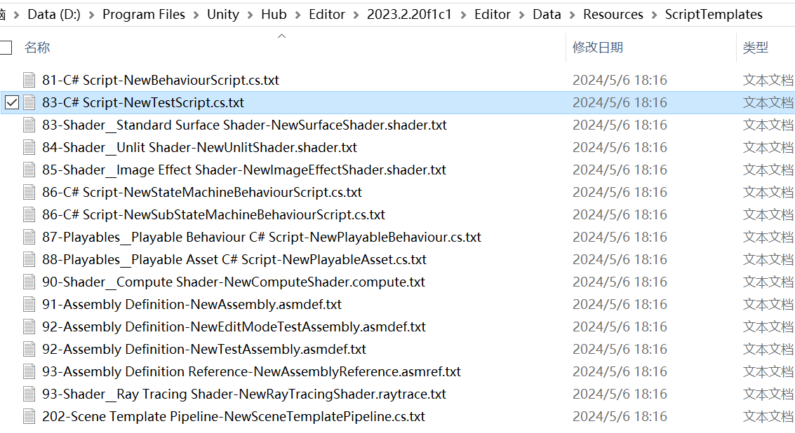
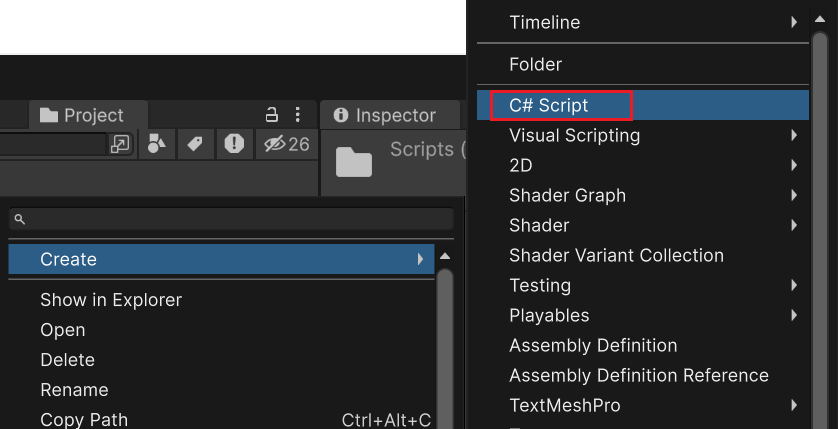
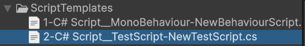

### 简介

- 编辑器内置的脚本模版：Editor\Data\Resources\ScriptTemplates
- 自定义脚本模版规则
    - 文件名前面的数字代表编辑器加载（相同类型）模版的优先级，数字越小优先级越高
    - 模版文件以.txt为后缀
    - 命名规则：{优先级}-{菜单选项}__{子菜单选项}-{文件名}.{文件后缀}.txt
        - 若无子菜单选项则无需添加：__{子菜单选项}
    - 每次修改完ScriptTemplates目录下的文件后需要重启编辑器才能正常生效
    - 模版所在目录规则
        - 方案1：放到上述的ScriptTemplates目录下，但由于关联具体Unity编辑器版本所在的目录，因此升级版本后则需要重新配置
        - 【推荐】方案2：放到在Assets新增的ScriptTemplates目录（Unity制定的特殊目录，启动时会检测这些特殊目录），升级版本后无需重新配置，同时可通过export导出为UnityPackage文件提供其他项目适用
- 示例：
    - 改动前：
        - 
    - 改动后：
        - 
        - 